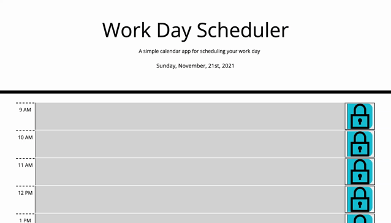

# work-day-scheduler

## Description
This work day scheduler allows you to save important events for each hour of the day over standard business hours so that you can manage your time effectively! Each timeb lock will be color-coded based on whether it is in the past, present, or future!

* The current day is displayed at the top of the scheduler

* You can add, edit and save tasks for each hour between 9AM to 5PM standard business hours

* Each task will be color coded grey if it has passed, red if it's within the current hour or green if it's in the future

* Your saved tasks will stay in it's corresponding time block for the next day!

 

## URL Link and mock-up
* [URL of deployed application]
https://github.com/Chis517/work-day-scheduler.git

* [URL of repo]
https://chis517.github.io/work-day-scheduler/

* [SSH of repo]
git@github.com:Chis517/work-day-scheduler.git

* [Screenshot of deployed application]

    

